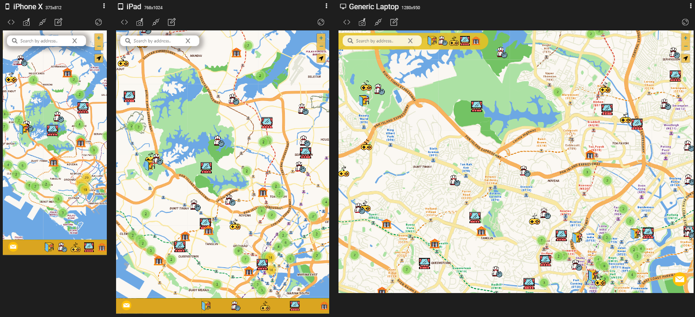
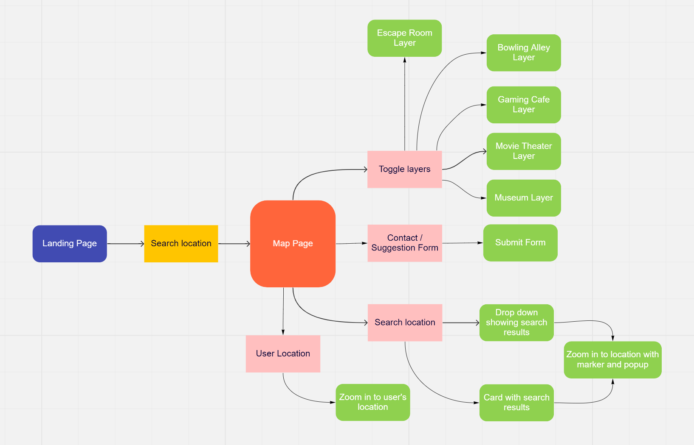
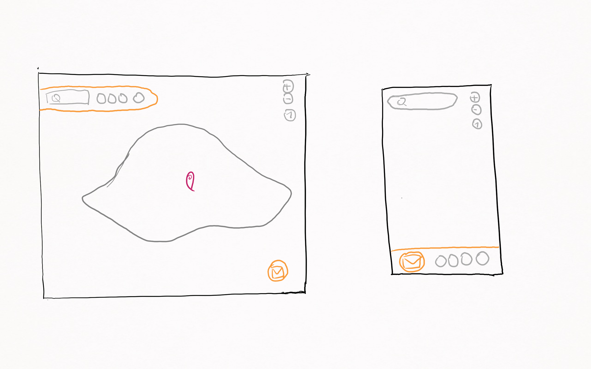
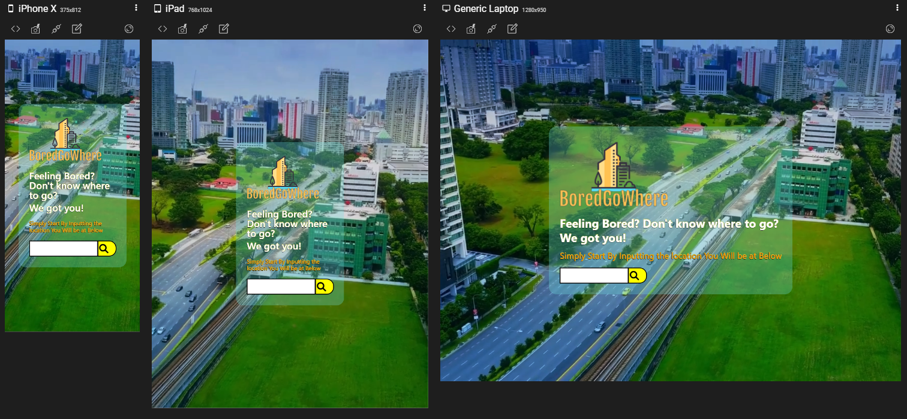

# BoredGoWhere

The live demo of the website can be accessed [here](https://main--boredgowhere.netlify.app/)

## 1. Project Summary

### Project Context

BoredGoWhere is a mobile responsive web application with an interactive map that allows user to explore what indoor entertainment there are around a given location.

### Target Audience

The target audience are local Singaporeans who may not know what to do around the area they are at or planning to meet at, either alone or with friends.  

### Organisational Goals

The web application aims to help local Singaporeans find interesting things to do at their convenience by searching around an area they intend to be at. 
The web application also aims to promote less well-known activities and places to help these businesses find more customers during this period where many are recovering from the covid pandemic.

### User goals

The users will use this web application to find out what activities are available around the intended area they are at or will be at, so as to find something interesting to do at their convenience. The web application allows its users to achieve this by allowing them to search the address where they intend to be at and showing them what indoor entertainment activities are nearby them.

### Justification for the App
To explore activities around them, users would currently have to search on a specific category to know what is around them, and it is also difficult  for them to find the available activities for them at another place they are planning to go to at a later time. 

## 2. UI/UX

### Strategy

**Organistion**
* To promote the opening up of Sinagpore by helping users find interesting places to entertainment themselves at the convenience of where they are or plan to be at.

* To promote less well-known activities and places to help these businesses find more customers during this period where many are recovering from the covid pandemic.

**User**
* Objective: To find activities to entertainment myself around the area I am at or planning to go to.

* Needs: A convenient way to find interesting activities to do at a convenient location.

* Demographic: The web application is geared towards the general public of local Singaporeans, more towards the yound and middle aged.

* Pain point: Information that are ready online often requires you to search for a specific place or category of activities, rather than show you the different activities that are available near you.

* User Story: As a Singaporean who will be meeting my friends and not knowing being sure to do around the area, or being interested in finding new activities to do.  I want to find a place that is to our convenience where I can see what activites are near the location I plan to meet my friends at, rather than searching for a plcae and going there.

### Scope

**Functional Requirements**

Features
* Search based on location address
* Display the different activities available near them (current category of activities: Escape Room, Bowling Alley, Gaming Cafe, Movie Theater, Museums)
* Show current location of user
* Form to contact us to give us feedback, aask questions or suggest new categories for us to add. 

Content
* Information to naigate the web application
* Information on activity name and address
* Location of activites (via markers on map)

**Non-functional Requirements**
* The app should be mobile-responsive, so that users can use it on the go

### Structure

 

### Skeleton

 

## 3. Surface
**colours**: To give a fun and energetic vibe, warm colours are used. The colour scheme of the different gradients of yellow is used to achive this goal. This is with exception to the landing page video, which has to be contrasted with the yellow theme above it.

**Font Choice**: San Seriff is used for its legibility and readibility

**Icons and Markers**: The colours of the search markers and icon markers are selected to match the colour scheme of the web application.

## 4. Features
Features | Descriptions
-------- | -------------
Generate entertainment locations | This feature generates entertainment activity locations on the map based on five categories - Escape Room, Bowling Alley, Gaming cafe, Movie Theater and Museums)
Search based on location address | This feature allows users to search for a location based on address or postal code
Show current location of user | This feature allows users to see their current location on their map and zoom into it.
Contact / Suggestion form | This feature allows users to submit a message to the database. The form has validation which would prompt users when their input is invalid upon submission. However, this feature is still a work in progress as there is no backend to handle the submission request.

## 5. Limitations and future implementations
Limitations | Future Implementations to Resolve Limitations
----------- | -------------
Popup and search cards only shows name and address of locations | Find an API that allows more relevant information to be grabbed
There is no backedn server to store messages from users | Create a database that is able to store user messages. | 
The web application pnly shows user's locations, user's searched location and markers for each entertainment category. With a routing function, more value can be added to the users|Create a routing location that allows users to plot from their selected starting location to their selected entertainment location.

## 6. Testing

### Test cases
The test cases can be found [here](https://github.com/samuelpng/TGC-Project1/blob/main/BoredGoWhere-Test%20Case.pdf)

### Testing for mobile responsiveness.
Testing was done using responsively for iPhone X, iPad and Generic Laptop. 
Image for mobile responsiveness testing of map page can be found above and the testing for landing page is as shown below

## 7. Technologies used 

| Tech  | Usage |
| ------------- | ------------- |
| HTML, CSS, Javascript, Bootstrap 5 | Build the main frame of the website  |
| [Axios](https://axios-http.com/docs/intro)  | Call APIs  |
| [Leaflet](https://leafletjs.com/)  | Create map and markers  |
| [Leaflet Geolocation plug-in](https://github.com/domoritz/leaflet-locatecontrol)  | Locate user location |
| Flaticon  | Use icons throughout the web application  |
| FreeLogoDesign| Create landing page logo|
| [Netlify](https://www.netlify.com/)| Deployment of website

## 8. Deployment
The web application is hosted on [Netlify](https://main--boredgowhere.netlify.app/)

Icons and images

## 9. Credits

### Icons and images:

1. [Flaticon](https://www.flaticon.com/) - Images used to customise layer and marker icons
2. [FreeLogoDesign](https://www.freelogodesign.org/) - To create logo for landing page
3. [YouTube](https://www.youtube.com) - To grab video for landing page
4. [Netlify](https://www.netlify.com/) - For deployment of website

### Datasets:

1. [Foursquare](https://developer.foursquare.com/reference/place-search)
    - Data used to plot markers for entertainment locations on the map, and to retrieve details for each location

2. [OneMap](https://www.onemap.gov.sg/docs/)
    - Data used to grab address location details details for search engine

3. [Domoritz Github leaflet-locate control](https://github.com/domoritz/leaflet-locatecontrol)
    - Plugin used to locate user's location